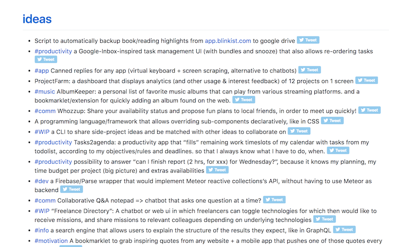

# Adrien Joly's ideas

A list of ideas exported from my public wunderlist list.

You can read it from [adrienjoly.com/ideas](https://adrienjoly.com/ideas).

This list was generated in Markdown+HTML/Jekyll from my Wunderlist JSON dump, using a small Nodejs script: [wunderlist-to-md.js](wunderlist-to-md.js).

Next steps:

- [Load tweet count for each idea](https://github.com/adrienjoly/ideas/issues/1)
- [Experiment: use jekyll to render ideas from a JSON file #2](https://github.com/adrienjoly/ideas/issues/2)
